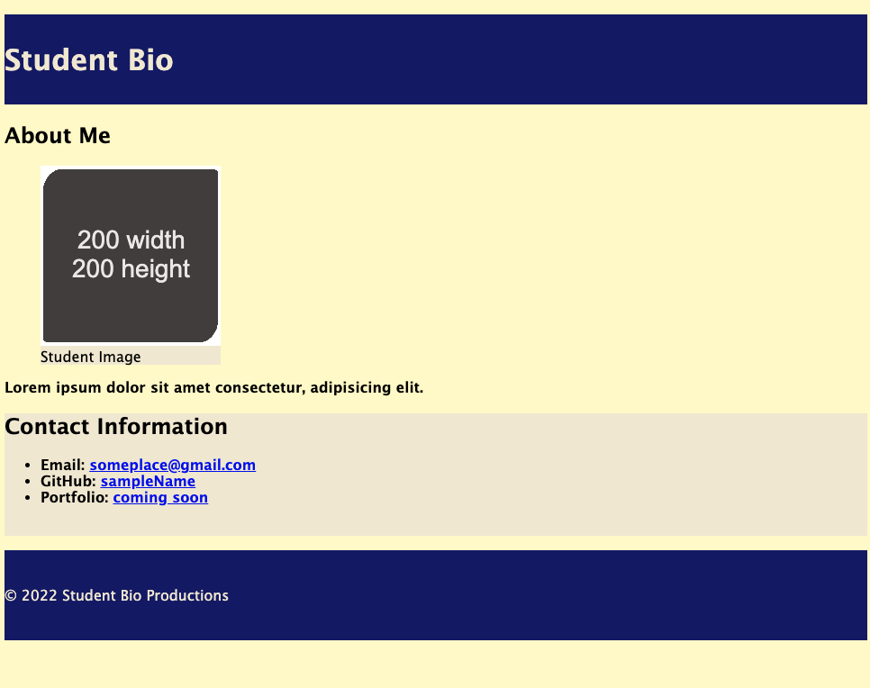
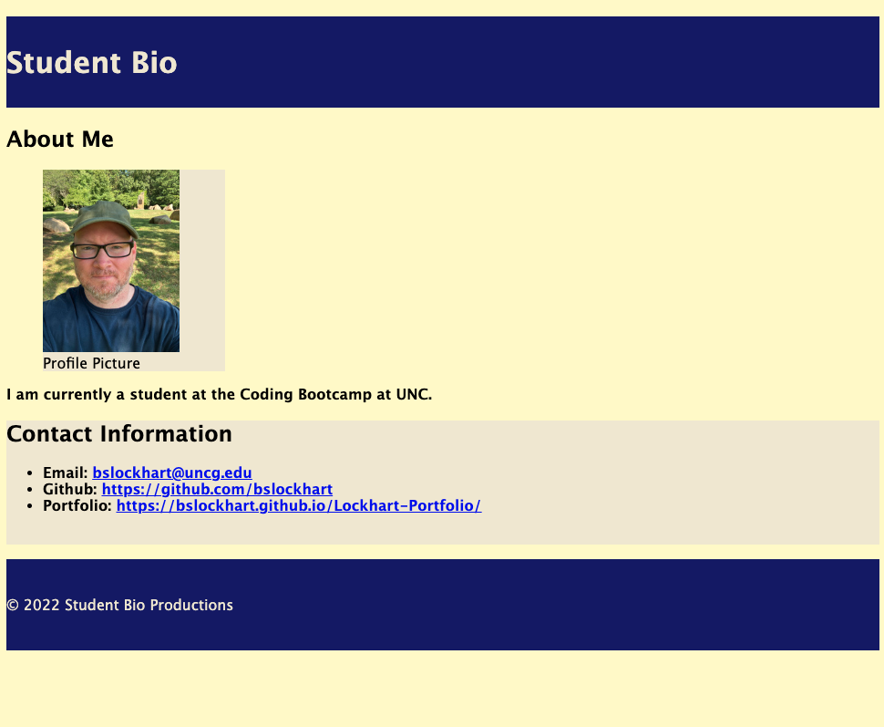

# 📐 Add Comments to Implementation of CSS Selectors

Work with a partner to add comments that describe the functionality of the code found in [Unsolved](./Unsolved/assets/css/style.css).

## 📝 Notes

Refer to the documentation: 

[MDN Web Docs on HTML elements](https://developer.mozilla.org/en-US/docs/Web/HTML/Element)

[MDN Web Docs on attributes](https://developer.mozilla.org/en-US/docs/Glossary/Attribute)

[MDN Web Docs on CSS selectors](https://developer.mozilla.org/en-US/docs/Web/CSS/CSS_Selectors)

---

## Mockup
* The following image demonstrates the web application's appearance and functionality:
* Unsolved Application Appearance.

* Solved Application appearance.

## 🏆 Bonus

* If you have completed this activity, work through the following challenge with your partner to further your knowledge:

- What are pseudo-class selectors?
- A pseudo-class is a selector that selects elements that are in a specific state, e.g. they are the first element of their type, or they are being hovered over by the mouse pointer. 

Use [Google](https://www.google.com) or another search engine to research this.

## Submission
* See files for comments

---